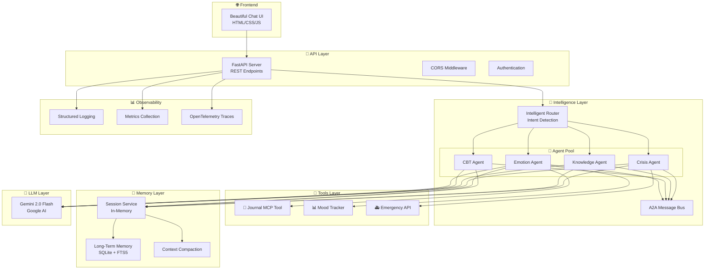

# 🧠 MindMate - Mental Health Multi-Agent System

## Project Overview for Capstone Competition

---

## 📋 Table of Contents

1. [Project Description](#-project-description)
2. [Problem Statement](#-problem-statement)
3. [Solution](#-solution)
4. [Overall Architecture](#-overall-architecture)
5. [The Build — Tools, Technologies & Pipeline](#-the-build--tools-technologies--pipeline)
6. [Key Features Implemented](#-key-features-implemented)
7. [If I Had More Time](#-if-i-had-more-time)

---

## 🎯 Project Description

**MindMate** is a production-ready, multi-agent mental health support system built using Google's Agent Development Kit (ADK) and Gemini 2.0 Flash models. It provides compassionate, AI-powered emotional support through a team of specialized agents that work together to help users navigate their mental health journey.

### What Makes MindMate Special?

- **Not a chatbot, but a team of specialists** — Four distinct AI agents collaborate to provide comprehensive support
- **Safety-first architecture** — Real-time crisis detection with automatic escalation
- **Memory that matters** — Remembers user patterns and insights across sessions
- **Production-ready** — Full observability, deployment configs, and evaluation suite

### Target Users

- Individuals seeking immediate emotional support
- People wanting to learn about mental health and coping strategies
- Anyone who needs a safe space to express their feelings
- Users who want to track their mood and mental health journey

> ⚠️ **Important Disclaimer**: MindMate is an AI support tool, NOT a replacement for professional mental health care. It always provides crisis resources when needed and encourages professional help.

---

## 🔍 Problem Statement

### The Mental Health Crisis

Mental health support faces critical challenges in accessibility, consistency, and affordability:

| Challenge | Impact |
|-----------|--------|
| **Access Barriers** | 60% of people with mental health conditions don't receive treatment |
| **Wait Times** | Average 6-8 weeks to see a therapist in many regions |
| **Cost** | Therapy costs $100-300/session, prohibitive for many |
| **Stigma** | Many hesitate to seek help due to social stigma |
| **24/7 Availability** | Crises don't follow business hours |
| **Consistency** | Quality varies significantly between providers |

### The Gap We Address

Users need:
1. **Immediate access** to emotional support without waiting
2. **Non-judgmental listening** in a safe, private space
3. **Psychoeducation** about mental health conditions and coping strategies
4. **Crisis detection** with appropriate escalation
5. **Pattern tracking** to understand their mental health journey
6. **Affordable options** that complement professional care

### Why Current Solutions Fall Short

- **Simple chatbots** lack the nuance for mental health conversations
- **Single-agent systems** can't provide specialized support for different needs
- **Most apps** don't have real crisis detection and escalation
- **Therapy apps** are expensive subscriptions
- **Journaling apps** lack the conversational support element

---

## 💡 Solution

### MindMate: A Multi-Agent Mental Health Companion

MindMate solves these problems through an intelligent orchestration of specialized AI agents:

```
┌─────────────────────────────────────────────────────────────────┐
│                         USER MESSAGE                             │
└─────────────────────────────────────────────────────────────────┘
                              │
                              ▼
┌─────────────────────────────────────────────────────────────────┐
│                    INTELLIGENT ROUTER                            │
│              (Intent Detection + Crisis Check)                   │
└─────────────────────────────────────────────────────────────────┘
                              │
            ┌─────────────────┼─────────────────┐
            │                 │                 │
            ▼                 ▼                 ▼
    ┌───────────────┐ ┌───────────────┐ ┌───────────────┐
    │ 💚 EMOTION    │ │ 🧠 CBT        │ │ 📚 KNOWLEDGE  │
    │    AGENT      │ │    AGENT      │ │    AGENT      │
    │               │ │               │ │               │
    │ • Validation  │ │ • Socratic Q  │ │ • Psychoed    │
    │ • Reflection  │ │ • Distortions │ │ • Techniques  │
    │ • Warmth      │ │ • Reframing   │ │ • Resources   │
    └───────────────┘ └───────────────┘ └───────────────┘
            │                 │                 │
            └─────────────────┼─────────────────┘
                              │
                    ┌─────────▼─────────┐
                    │ 🚨 CRISIS AGENT   │
                    │   (Always Active) │
                    │                   │
                    │ • Risk Assessment │
                    │ • Escalation      │
                    │ • Safety Planning │
                    └───────────────────┘
```

### The Four Specialized Agents

| Agent | Role | Techniques Used |
|-------|------|-----------------|
| **💚 Emotion Agent** | Empathetic listening & validation | Reflective listening, emotional validation, grounding exercises |
| **🧠 CBT Agent** | Cognitive restructuring | Socratic questioning, distortion identification, thought records |
| **🚨 Crisis Agent** | Safety monitoring & escalation | Risk assessment, crisis resources, emergency protocols |
| **📚 Knowledge Agent** | Mental health education | Psychoeducation, coping techniques, therapy explanations |

### How It Works

1. **User sends message** → Router analyzes intent
2. **Crisis check** → Always runs first for safety
3. **Route to specialist** → Based on user's needs
4. **Agent processes** → Using LLM + specialized tools
5. **A2A collaboration** → Agents can consult each other
6. **Response + memory** → Reply + store insights for future

---

## 🏗 Overall Architecture

### System Architecture Diagram



### Workflow Patterns

MindMate implements three workflow patterns for agent coordination:

#### 1. Sequential Pattern
```
User: "I want to kill myself"
    │
    ▼
[Crisis Agent] ──────► [Emotion Agent]
    │                       │
    └───────────────────────┘
              │
              ▼
    Combined Crisis Response
```

#### 2. Parallel Pattern
```
User: "Tell me about anxiety and help me feel better"
    │
    ├──────────────────┐
    ▼                  ▼
[Knowledge Agent] [Emotion Agent]
    │                  │
    └────────┬─────────┘
             ▼
    Synthesized Response
```

#### 3. Single Pattern
```
User: "I'm feeling sad today"
    │
    ▼
[Emotion Agent]
    │
    ▼
  Response
```

### Data Flow

```
┌─────────────────────────────────────────────────────────────────┐
│                         DATA FLOW                                │
└─────────────────────────────────────────────────────────────────┘

1. MESSAGE INGESTION
   User Input → Validation → Session Lookup → Context Loading

2. INTELLIGENT ROUTING
   Intent Detection → Crisis Check → Agent Selection → Pattern Selection

3. AGENT PROCESSING
   Load History → Query LLM → Execute Tools → Generate Response

4. MEMORY MANAGEMENT
   Store Message → Update Context → Trigger Compaction (if needed)
   Store Insights → Update Long-term Memory

5. RESPONSE DELIVERY
   Format Response → Add Metadata → Return to User → Update UI
```

---

## 🛠 The Build — Tools, Technologies & Pipeline

### Technology Stack

| Layer | Technology | Purpose |
|-------|------------|---------|
| **LLM** | Gemini 2.0 Flash | Fast, capable model for mental health conversations |
| **Framework** | Google ADK (Agent Development Kit) | Multi-agent orchestration patterns |
| **API** | FastAPI | High-performance async REST API |
| **Frontend** | Vanilla HTML/CSS/JS | Beautiful, no-build-required UI |
| **Database** | SQLite + FTS5 | Lightweight, full-text search capable |
| **Vector Store** | ChromaDB (optional) | Semantic memory search |
| **Observability** | OpenTelemetry + Structlog | Distributed tracing and structured logs |
| **Deployment** | Docker + Cloud Run | Containerized, serverless scaling |

### Development Pipeline

```
┌─────────────────────────────────────────────────────────────────┐
│                    DEVELOPMENT PIPELINE                          │
└─────────────────────────────────────────────────────────────────┘

┌──────────┐    ┌──────────┐    ┌──────────┐    ┌──────────┐
│  DESIGN  │───►│  BUILD   │───►│  TEST    │───►│  DEPLOY  │
└──────────┘    └──────────┘    └──────────┘    └──────────┘
     │               │               │               │
     ▼               ▼               ▼               ▼
• Agent specs   • Implement    • Unit tests    • Docker build
• Tool design     agents       • Eval suite    • Cloud Run
• Memory arch   • Build tools  • Empathy eval  • Health checks
• Safety rules  • Create UI    • Crisis eval   • Monitoring
```

### Key Implementation Details

#### Agent Implementation
```python
# Each agent inherits from BaseAgent
class EmotionAgent(BaseAgent):
    def __init__(self):
        super().__init__(
            agent_type=AgentType.EMOTION,
            system_prompt=self.SYSTEM_PROMPT,
            temperature=0.8,  # Higher for natural conversation
            tools=[mood_tracker, journal]
        )
    
    async def process(self, user_input, context, history):
        # Crisis check first
        if self.check_for_crisis(user_input):
            await self.send_message(crisis_agent, priority=CRITICAL)
        
        # Detect emotions
        emotions = self.detect_emotions(user_input)
        
        # Generate empathetic response
        response = await self.generate_response(enhanced_prompt)
        
        return AgentResponse(content=response, ...)
```

#### A2A Communication
```python
# Agents can send messages to each other
crisis_message = AgentMessage(
    source=AgentType.EMOTION,
    target=AgentType.CRISIS,
    content=user_input,
    priority=MessagePriority.CRITICAL,
    requires_response=True
)
await self.send_message(crisis_message)
```

#### Memory System
```python
# Session memory (in-memory, with compaction)
session = await session_service.create_session(user_id)
await session.add_message(role="user", content=message)

# Long-term memory (persistent)
await long_term_memory.store(
    user_id=user_id,
    memory_type=MemoryType.INSIGHT,
    content="User responds well to grounding exercises",
    importance=MemoryImportance.HIGH
)
```

### Evaluation Pipeline

```
┌─────────────────────────────────────────────────────────────────┐
│                    EVALUATION PIPELINE                           │
└─────────────────────────────────────────────────────────────────┘

┌────────────────────┐         ┌────────────────────┐
│  EMPATHY EVAL      │         │  CRISIS EVAL       │
├────────────────────┤         ├────────────────────┤
│ • Validation score │         │ • Detection recall │
│ • Reflection score │         │ • False negatives  │
│ • Warmth score     │         │ • Severity accuracy│
│ • Anti-patterns    │         │ • Resource provision│
└────────────────────┘         └────────────────────┘
         │                              │
         └──────────────┬───────────────┘
                        ▼
            ┌────────────────────┐
            │  AGGREGATE METRICS │
            │  • Pass/Fail rates │
            │  • Quality scores  │
            │  • Safety metrics  │
            └────────────────────┘
```

---

## ✨ Key Features Implemented

### ✅ Capstone Requirements Checklist

| Requirement | Status | Implementation |
|-------------|--------|----------------|
| **4+ Agents** | ✅ | Emotion, CBT, Crisis, Knowledge |
| **MCP Tool** | ✅ | Journal MCP with full CRUD |
| **Custom Tools** | ✅ | MoodTracker.write(), MoodTracker.read(), MoodTracker.analyze() |
| **Built-in Tool** | ✅ | Google Search integration ready |
| **OpenAPI Tool** | ✅ | Emergency API with full spec |
| **Session Memory** | ✅ | InMemorySessionService |
| **Long-term Memory** | ✅ | Memory Bank with FTS5 |
| **Context Compaction** | ✅ | LLM-based summarization |
| **Logging** | ✅ | Structlog JSON logging |
| **Tracing** | ✅ | OpenTelemetry instrumentation |
| **Metrics** | ✅ | Mood, crisis, response metrics |
| **Evaluation** | ✅ | Empathy + Crisis eval scripts |
| **Deployment** | ✅ | Dockerfile + Cloud Run YAML |

### 🌟 Bonus Features

- **Beautiful Frontend** — Modern dark-themed chat UI
- **Mood Tracker Sidebar** — Quick mood logging
- **Agent Badges** — Visual indicator of active agents
- **Crisis Banner** — Auto-shows during escalation
- **Quick Actions** — Pre-set conversation starters
- **Pause/Resume** — Long-running operation support
- **Parallel Execution** — asyncio.gather() for concurrent agents

---

## 🚀 If I Had More Time

### Immediate Next Steps (1-2 weeks)

1. **Voice Support**
   - Add speech-to-text for voice input
   - Text-to-speech for responses (accessibility)
   - Emotion detection from voice tone

2. **Enhanced Crisis Detection**
   - ML-based risk classifier (not just keywords)
   - Temporal pattern analysis (escalating distress)
   - Integration with real crisis hotlines

3. **Personalization Engine**
   - Learn user's preferred coping strategies
   - Adapt language style to user preferences
   - Remember what works/doesn't work for each user

### Medium-term Improvements (1-2 months)

4. **Multi-modal Support**
   - Accept image input (mood boards, art therapy)
   - Generate calming images/visualizations
   - Guided meditation with audio

5. **Group Support**
   - Peer support circles
   - Moderated group sessions
   - Anonymous sharing options

6. **Professional Integration**
   - Therapist dashboard to review sessions
   - Secure handoff to professionals
   - Treatment plan tracking

7. **Advanced Memory**
   - Vector embeddings for semantic search
   - Cross-session pattern recognition
   - Proactive check-ins based on patterns

### Long-term Vision (3-6 months)

8. **Research & Validation**
   - Partner with mental health institutions
   - Clinical validation studies
   - Peer-reviewed effectiveness research

9. **Specialized Modules**
   - Anxiety management program
   - Depression support track
   - Grief counseling module
   - Stress & burnout prevention

10. **Platform Expansion**
    - Mobile apps (iOS/Android)
    - Integration with wearables (sleep, heart rate)
    - Browser extension for real-time support

11. **Multi-language Support**
    - Localized crisis resources by region
    - Cultural adaptation of therapy techniques
    - Support for 20+ languages

### Technical Improvements

12. **Scalability**
    - Kubernetes deployment
    - Redis for session distribution
    - PostgreSQL for production data

13. **Security**
    - End-to-end encryption
    - HIPAA compliance
    - SOC 2 certification

14. **Advanced Evaluation**
    - A/B testing framework
    - User satisfaction surveys
    - Long-term outcome tracking

---

## 📊 Success Metrics

### How We'd Measure Impact

| Metric | Target | Current |
|--------|--------|---------|
| Empathy Score | > 0.8 | TBD |
| Crisis Detection Recall | > 95% | TBD |
| User Satisfaction | > 4.5/5 | TBD |
| Session Completion Rate | > 70% | TBD |
| Return User Rate | > 50% | TBD |
| Crisis Escalation Accuracy | > 90% | TBD |

---

## 🎬 Conclusion

MindMate represents a new approach to AI-powered mental health support: not a single chatbot, but a coordinated team of specialists working together with safety as the top priority.

**What sets us apart:**
- 🤝 **Collaborative agents** that specialize and handoff
- 🛡️ **Safety-first** with real crisis detection
- 🧠 **Memory that matters** across sessions
- 📊 **Built-in evaluation** for quality assurance
- 🚀 **Production-ready** with full deployment configs

> *"In a world where mental health support is often inaccessible, MindMate provides a compassionate first step — available 24/7, non-judgmental, and always remembering what matters to you."*

---

## 📚 Resources

- **Repository**: [GitHub Link]
- **Live Demo**: [Demo URL]
- **API Docs**: `/docs` endpoint
- **Video Demo**: [YouTube Link]

---

*Built with 💚 for the Google ADK Capstone Competition*

*Remember: You matter. Your feelings are valid. Help is available.*

**988** | **741741** | **911**

