# 🧠 MindMate - Mental Health Multi-Agent Support System

<div align="center">


**A production-ready multi-agent system providing compassionate mental health support**

[Features](#-features) •
[Architecture](#-architecture) •
[Quick Start](#-quick-start) •
[Agents](#-agents) •
[Tools](#-tools) •
[API](#-api-reference) •
[Deployment](#-deployment)

</div>

---

## ⚠️ Important Disclaimer

> **MindMate is an AI-powered support tool, NOT a replacement for professional mental health care.**
> 
> If you or someone you know is experiencing a mental health crisis:
> - **US**: Call 988 (Suicide & Crisis Lifeline) or text HOME to 741741
> - **UK**: Call 116 123 (Samaritans) or text SHOUT to 85258
> - **Emergency**: Call your local emergency services (911, 999, etc.)

---

## ✨ Features

### 🤖 Multi-Agent System
- **4 Specialized Agents** working in harmony to provide comprehensive support
- **Intelligent Routing** automatically directs conversations to the right agent
- **A2A Communication** enables agents to collaborate and escalate seamlessly

### 🛡️ Safety First
- **Real-time Crisis Detection** with configurable sensitivity thresholds
- **Automatic Escalation** to crisis protocols when needed
- **Emergency Resource Provision** with region-specific hotlines

### 🧰 Powerful Tools
- **MCP-based Journaling** for structured mental health journaling
- **Mood Tracking & Analysis** with pattern detection
- **OpenAPI Emergency Integration** for external alert systems

### 💾 Persistent Memory
- **Session Management** with context compaction for long conversations
- **Long-term Memory Bank** remembers user patterns and insights across sessions
- **Semantic Search** for relevant memory retrieval

### 📊 Full Observability
- **Structured Logging** with JSON output
- **OpenTelemetry Tracing** for request flows
- **Comprehensive Metrics** for monitoring and alerting

### 🚀 Production Ready
- **Docker Container** optimized for cloud deployment
- **Cloud Run Configuration** for serverless scaling
- **Agent Engine Support** for managed agent hosting

---

## 🏗️ Architecture

### System Overview

```mermaid
graph TB
    subgraph Client["🌐 Client Layer"]
        UI[Web/Mobile UI]
        API[REST API Client]
    end

    subgraph Gateway["🚪 API Gateway"]
        FastAPI[FastAPI Server]
        Auth[Authentication]
    end

    subgraph Router["🔀 Intelligent Router"]
        Intent[Intent Detection]
        Route[Agent Routing]
        Workflow[Workflow Orchestration]
    end

    subgraph Agents["🤖 Agent Layer"]
        EA[Emotion Agent<br/>💚 Empathetic Support]
        CBT[CBT Agent<br/>🧠 Cognitive Restructuring]
        CA[Crisis Agent<br/>🚨 Safety & Escalation]
        KA[Knowledge Agent<br/>📚 Psychoeducation]
    end

    subgraph Tools["🧰 Tool Layer"]
        Journal[📔 Journal MCP]
        Mood[📊 Mood Tracker]
        Emergency[🚑 Emergency API]
        Search[🔍 Google Search]
    end

    subgraph Memory["💾 Memory Layer"]
        Session[Session Service<br/>In-Memory]
        LTM[Long-Term Memory<br/>SQLite + Vector]
    end

    subgraph LLM["🤖 LLM Layer"]
        Gemini[Gemini 2.0 Flash]
    end

    UI --> FastAPI
    API --> FastAPI
    FastAPI --> Auth
    Auth --> Intent
    Intent --> Route
    Route --> Workflow
    
    Workflow --> EA
    Workflow --> CBT
    Workflow --> CA
    Workflow --> KA
    
    EA --> Journal
    EA --> Mood
    CBT --> Journal
    CA --> Emergency
    KA --> Search
    KA --> Journal
    
    EA --> Session
    CBT --> Session
    CA --> Session
    KA --> Session
    
    Session --> LTM
    
    EA --> Gemini
    CBT --> Gemini
    CA --> Gemini
    KA --> Gemini

    style EA fill:#10b981
    style CBT fill:#8b5cf6
    style CA fill:#ef4444
    style KA fill:#3b82f6
```



### Workflow Patterns


### Agent-to-Agent (A2A) Communication


---

## 🚀 Quick Start

### Prerequisites

- Python 3.11+
- Google Cloud account with Gemini API access
- (Optional) Docker for containerized deployment

### Installation

1. **Clone the repository**
```bash
git clone https://github.com/your-org/mindmate.git
cd mindmate
```

2. **Create virtual environment**
```bash
python -m venv venv
source venv/bin/activate  # On Windows: venv\Scripts\activate
```

3. **Install dependencies**
```bash
pip install -r requirements.txt
```

4. **Configure environment**
```bash
# Create .env file
cp .env.example .env

# Edit with your settings
# Required: MINDMATE_GOOGLE_API_KEY=your_api_key
```

5. **Run the application**
```bash
python app.py
```

6. **Open API docs**
```
http://localhost:8080/docs
```

### Docker Quick Start

```bash
# Build the image
docker build -t mindmate -f deployment/Dockerfile .

# Run the container
docker run -p 8080:8080 \
  -e MINDMATE_GOOGLE_API_KEY=your_api_key \
  mindmate
```

---

## 🤖 Agents

### 💚 Emotion Support Agent

The Emotion Agent provides warm, empathetic support using reflective listening techniques.

**Capabilities:**
- Validates and acknowledges feelings
- Reflects understanding back to users
- Detects emotional intensity
- Offers grounding exercises for anxiety

**Example Interaction:**
```
User: I'm feeling really overwhelmed and alone today.

Emotion Agent: I hear you - feeling overwhelmed and alone can be such 
a heavy combination to carry. It makes complete sense that you're 
struggling right now. Those feelings are valid. 

I'm here with you in this moment. What's weighing on you the most 
right now?
```

### 🧠 CBT Restructuring Agent

Uses Cognitive-Behavioral Therapy techniques to help identify and challenge unhelpful thought patterns.

**Capabilities:**
- Detects cognitive distortions (all-or-nothing, catastrophizing, etc.)
- Employs Socratic questioning
- Creates thought records
- Guides perspective reframing

**Example Interaction:**
```
User: I always fail at everything I try.

CBT Agent: I hear how discouraged you're feeling. That thought - 
"I always fail at everything" - sounds really painful to carry.

I'm curious about something: Can you think of any time, even a small 
one, where something you tried worked out, even partially?
```

### 🚨 Crisis Detection Agent

Monitors all conversations for crisis signals and coordinates emergency response.

**Capabilities:**
- Real-time risk assessment
- Severity classification (Low → Critical)
- Automatic escalation protocols
- Crisis resource provision
- Emergency webhook integration

**Example Interaction:**
```
User: I don't want to be here anymore.

Crisis Agent: I hear that you're going through something really 
difficult right now. Your safety matters to me. 

I want to ask directly - are you having thoughts of hurting yourself 
or ending your life?

If you're in immediate danger, please reach out:
• 988 Suicide & Crisis Lifeline (call or text)
• Text HOME to 741741 (Crisis Text Line)
• 911 for emergencies

I'm here with you. Can you tell me more about what's happening?
```

### 📚 Knowledge Therapy Agent

Provides psychoeducation and evidence-based mental health information.

**Capabilities:**
- Explains mental health topics accessibly
- Provides coping techniques with instructions
- Describes therapy types (CBT, DBT, ACT, etc.)
- References reputable sources

**Example Interaction:**
```
User: What is CBT and how does it work?

Knowledge Agent: ## Cognitive-Behavioral Therapy (CBT)

CBT is one of the most well-researched forms of therapy. It's based 
on the idea that our thoughts, feelings, and behaviors are all 
connected.

**Key Points:**
• Focuses on identifying unhelpful thought patterns
• Teaches practical skills to change thinking and behavior
• Usually short-term (12-20 sessions)
• Effective for anxiety, depression, and many other conditions

**How it works:**
1. Identify negative automatic thoughts
2. Examine the evidence for and against them
3. Develop more balanced perspectives
4. Practice new behaviors

*Sources: American Psychological Association, NIMH*
```

---

## 🧰 Tools

### 📔 Journal MCP Tool

MCP-based journaling for mental health tracking.

```python
# Write a journal entry
await journal.execute(
    action="write",
    user_id="user123",
    content="Today I practiced the breathing exercise...",
    entry_type="reflection",
    tags=["coping", "anxiety"]
)

# Analyze journal patterns
await journal.execute(
    action="analyze",
    user_id="user123",
    days=30
)
```

### 📊 Mood Tracker

Comprehensive mood logging and analysis.

```python
# Log mood
await mood_tracker.write(
    user_id="user123",
    mood_rating=7,
    emotions=["calm", "hopeful"],
    energy_level=6
)

# Get analysis
analysis = await mood_tracker.analyze(
    user_id="user123",
    days=30
)
# Returns: average_mood, trend, correlations, recommendations
```

### 🚑 Emergency API

OpenAPI-based emergency escalation.

```python
# Create crisis alert
await emergency_api.create_alert(
    user_id="user123",
    alert_type="crisis_detected",
    severity="high",
    trigger_message="User expressed suicidal ideation",
    risk_factors=["hopelessness", "isolation"]
)
```

---

## 📡 API Reference

### Chat Endpoint

```http
POST /chat
Content-Type: application/json

{
    "message": "I'm feeling anxious about tomorrow",
    "user_id": "user123",
    "session_id": "optional-session-id"
}
```

**Response:**
```json
{
    "response": "I hear that you're feeling anxious...",
    "session_id": "sess-abc123",
    "agents_used": ["emotion"],
    "workflow_pattern": "single",
    "processing_time_ms": 1250.5,
    "metadata": {
        "intent": "emotional_support",
        "confidence": 0.85
    }
}
```

### Session Management

```http
POST /session
GET /session/{session_id}
POST /session/{session_id}/end
```

### Mood Tracking

```http
POST /mood
GET /mood/{user_id}?days=7
GET /mood/{user_id}/analyze?days=30
```

### Journal

```http
POST /journal
GET /journal/{user_id}?limit=10
GET /journal/{user_id}/analyze?days=7
```

### Health & Metrics

```http
GET /health
GET /metrics
GET /crisis/resources?region=us
```

---

## 📊 Evaluation

MindMate includes comprehensive evaluation tools:

### Empathy Evaluation

Tests response empathy across multiple dimensions:
- Validation, Reflection, Warmth
- Non-judgment, Presence
- Anti-pattern detection (minimization, platitudes)

```bash
python -m evaluation.empathy_eval
```

### Crisis Detection Evaluation

Tests crisis detection accuracy:
- Precision, Recall (prioritized), F1 Score
- Severity classification accuracy
- Resource provision rate

```bash
python -m evaluation.crisis_eval
```

---

## 🚀 Deployment

### Cloud Run

```bash
# Build and push
gcloud builds submit --tag gcr.io/$PROJECT_ID/mindmate

# Deploy
gcloud run services replace deployment/cloudrun.yaml
```

### Agent Engine

```bash
# Deploy to Agent Engine
gcloud agent-engine deploy --config=deployment/agent_engine.json
```

### Environment Variables

| Variable | Description | Default |
|----------|-------------|---------|
| `MINDMATE_GOOGLE_API_KEY` | Gemini API key | Required |
| `MINDMATE_GEMINI_MODEL` | Model to use | `gemini-2.0-flash-exp` |
| `MINDMATE_LOG_LEVEL` | Logging level | `INFO` |
| `MINDMATE_CRISIS_THRESHOLD` | Crisis detection sensitivity | `0.7` |
| `MINDMATE_PORT` | Server port | `8080` |

---

## 📁 Project Structure

```
mindmate/
├── agents/                 # Agent implementations
│   ├── base_agent.py      # Base class with common functionality
│   ├── emotion_agent.py   # Empathetic support agent
│   ├── cbt_agent.py       # Cognitive-behavioral therapy agent
│   ├── crisis_agent.py    # Crisis detection & response agent
│   └── knowledge_agent.py # Psychoeducation agent
├── tools/                  # Tool implementations
│   ├── journal_mcp.py     # MCP journaling tool
│   ├── mood_tracker.py    # Mood tracking & analysis
│   ├── emergency_api.py   # Emergency escalation
│   └── emergency_api.yaml # OpenAPI specification
├── memory/                 # Memory systems
│   ├── session.py         # Session management
│   └── long_term_memory.py# Persistent memory bank
├── workflows/              # Orchestration
│   └── main_router.py     # Intelligent routing
├── evaluation/             # Evaluation tools
│   ├── empathy_eval.py    # Empathy metrics
│   └── crisis_eval.py     # Crisis detection metrics
├── deployment/             # Deployment configs
│   ├── Dockerfile
│   ├── cloudrun.yaml
│   └── agent_engine.json
├── app.py                  # Main application
├── config.py              # Configuration
├── requirements.txt       # Dependencies
└── README.md             # This file
```

---

## 🤝 Contributing

We welcome contributions! Please see our [Contributing Guide](CONTRIBUTING.md) for details.

### Development Setup

```bash
# Install dev dependencies
pip install -r requirements-dev.txt

# Run tests
pytest

# Run linting
ruff check .

# Run type checking
mypy .
```

---

## 📄 License

This project is licensed under the Apache License 2.0 - see the [LICENSE](LICENSE) file for details.

---

## 🙏 Acknowledgments

- Google AI for the Gemini models and ADK
- The mental health community for guidance on appropriate AI support
- All contributors and testers

---

<div align="center">

**Built with 💚 for mental wellness**

*Remember: You matter. Your feelings are valid. Help is available.*

**988** | **741741** | **911**

</div>

